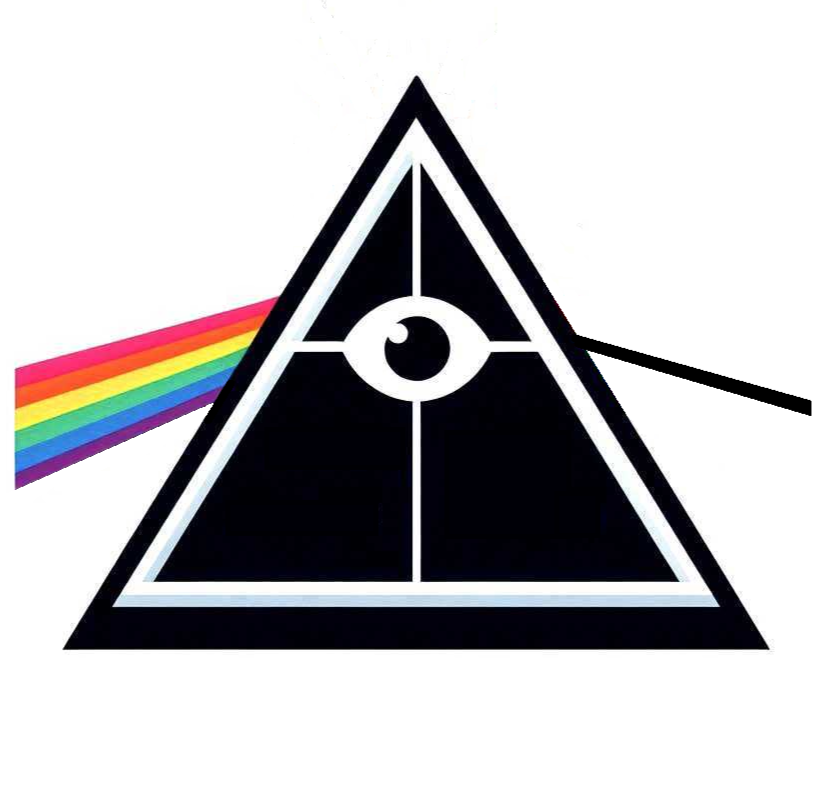

<table>
    <tbody>
        <tr>
            <td align="center" vertical-align="center" bgcolor="#fff" width="120px">
                
            </td>
            <td vertical-align="center">
                
<a href="/product-principles/">Product Principles</a> Explore Product, System, Code, Process/Teamwork and Culture principles behind high-quality products.

            </td>
        </tr>
    </tbody>
</table>

<table>
    <tbody>
        <tr>
            <td align="center" vertical-align="center" bgcolor="#fff" width="120px">
                
            </td>
            <td vertical-align="center">
                
Get notified as soon as new content gets published. <a data-formkit-toggle="441afe2f7b" href="https://testwhere.ck.page/441afe2f7b">Subscribe to the Newsletter!</a>

            </td>
        </tr>
    </tbody>
</table>

<table>
    <tbody>
        <tr>
            <td align="center" vertical-align="center" bgcolor="#fff" width="120px">
                
            </td>
            <td vertical-align="center">
                
<a href="https://qlty-pulse.com">QLTY PULSE Conference</a> Get to know this free-of-charge community conference for Quality specialists in Lithuania.

            </td>
        </tr>
    </tbody>
</table>